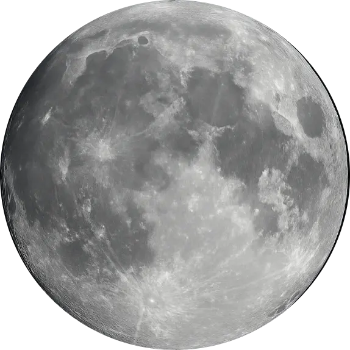

# 🌙 LunaQR

**Private. Instant. Professional.**

LunaQR is a premium, privacy-first QR code generator that runs entirely in your browser. No server-side processing, no data tracking, just high-quality QR codes delivered instantly.



## ✨ Features

-   **Privacy by Design**: All generation happens client-side. Your URLs, text, and logos never leave your browser.
-   **Premium Aesthetics**: A modern UI with Dark and Light themes inspired by GitHub's color system.
-   **Real-time Generation**: See your changes instantly as you type.
-   **Custom Branding**: Upload your logo and scale it to fit perfectly within the QR code.
-   **High-Quality Exports**:
    -   **PNG**: Pixel-perfect images with logo support.
    -   **SVG**: Scalable vector graphics with embedded logos (base64) for professional use.
-   **Fine-tuned Controls**:
    -   Adjustable Error Correction (Resilience) levels.
    -   Customizable sizing and safe margins.
    -   Multiple background modes: Light, Dark, and Transparent.

## 🚀 Deployment

LunaQR is a pure static web application, making it perfect for hosting on **GitHub Pages**, Netlify, or Vercel.

### Hosting on GitHub Pages
1. Push this repository to GitHub.
2. Go to **Settings > Pages**.
3. Select the branch and folder (e.g., `main` / `root`) and click **Save**.
4. Your premium QR generator will be live at `https://your-username.github.io/repo-name/`.

## 🛠️ Technology Stack

-   **HTML5 & CSS3**: Utilizing modern features like CSS variables, backdrop filters, and grid layouts.
-   **Vanilla JavaScript**: Lightweight and fast, no heavy frameworks.
-   **[QRCode.js](https://github.com/davidshimjs/qrcodejs)**: Reliable and robust QR generation engine.
-   **Fonts**: Plus Jakarta Sans & Outfit for a premium typographic experience.

## 📦 Installation & Local Development

Since LunaQR is static, you don't need to install any dependencies.

1. Clone the repository:
   ```bash
   git clone https://github.com/Pamperito74/luna-qr.git
   ```
2. Open `index.html` in your favorite browser.
3. (Optional) Use a local server like `Live Server` in VS Code for a better development experience.

## 🤝 Contributing

Contributions are welcome! If you have ideas for new themes, features, or performance improvements, feel free to open an issue or submit a pull request.

## 📄 License

Distributed under the MIT License. See `LICENSE` for more information.

---

Built with ❤️ by [Pamperito74](https://github.com/Pamperito74)
